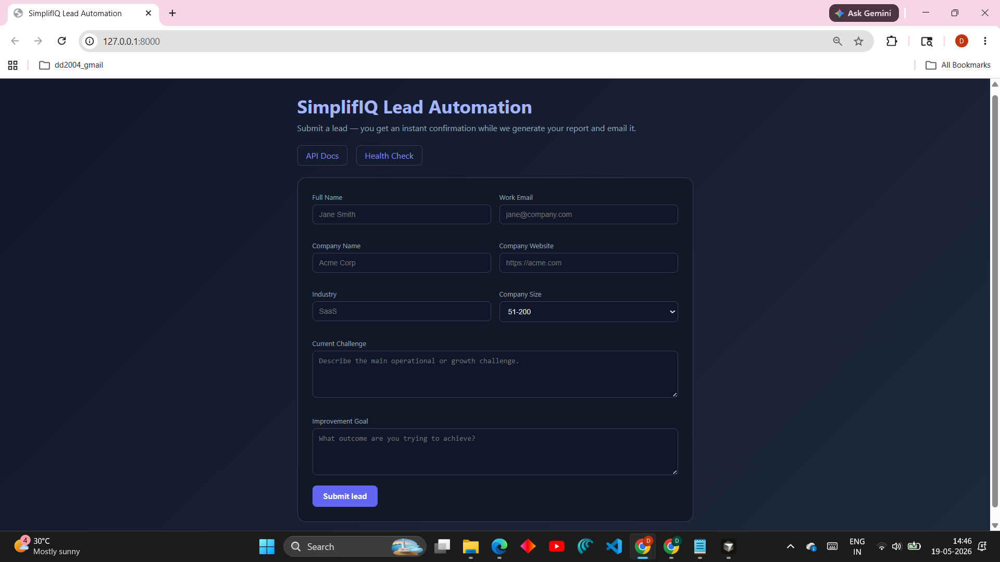
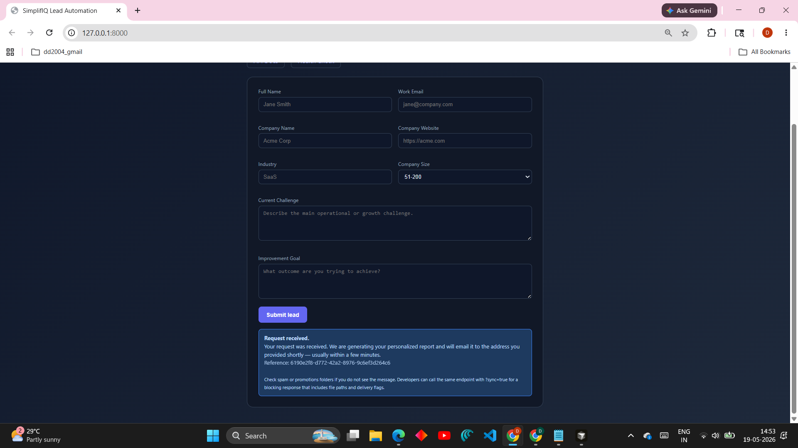
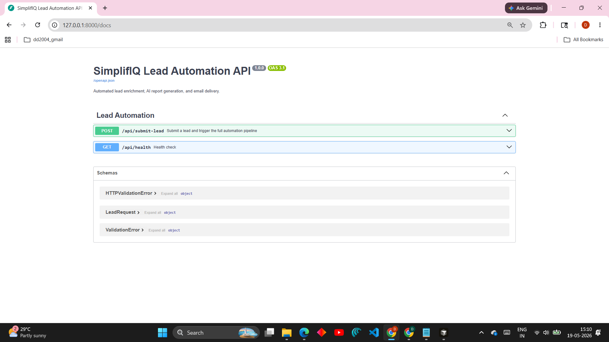
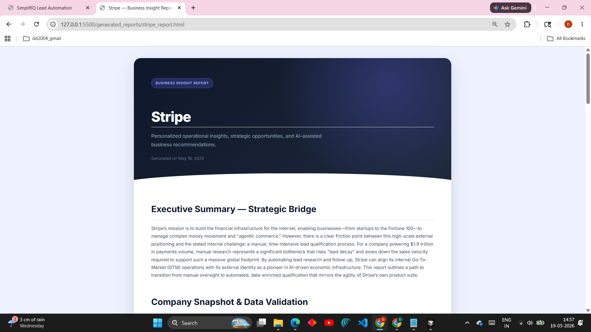
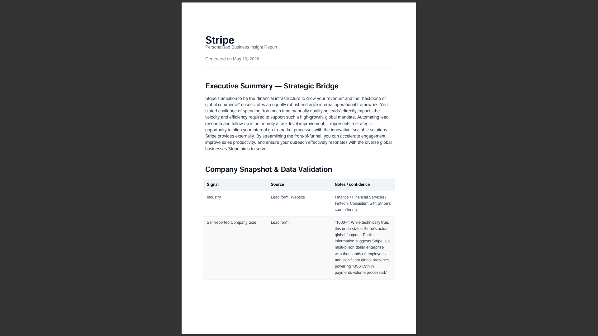
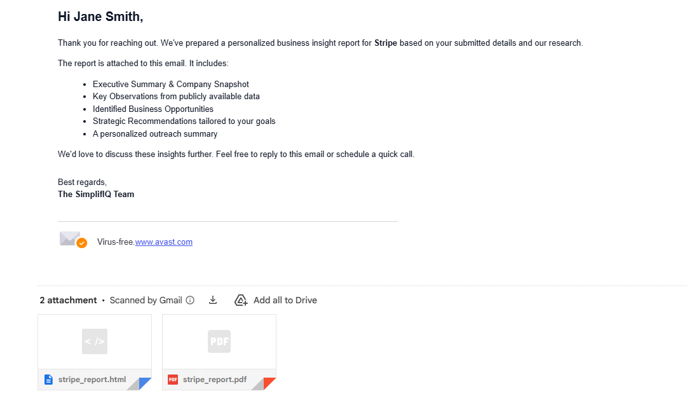
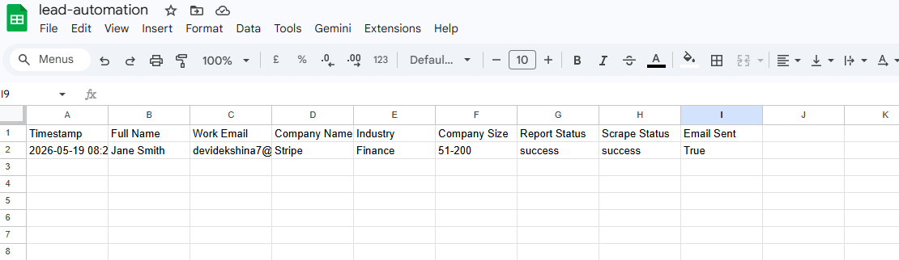
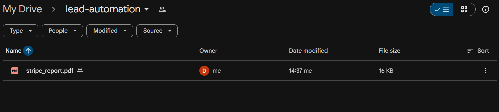

# SimplifIQ Lead Automation

Automated lead intake: validate → scrape/enrich → AI report (HTML + PDF) → email → optional Google Sheets + Drive.

**Documentation:** [docs/ARCHITECTURE.md](docs/ARCHITECTURE.md) — system design, assumptions, tradeoffs, limitations, failure handling.

## Demo

### Lead Intake Form



### Submission Confirmation



## Features

- **Lead validation** — Pydantic + server-side checks
- **Company enrichment** — Public homepage scrape with fallbacks
- **AI report** — Gemini, prompt-driven structure tuned for consultative output
- **Reports** — Styled HTML (Jinja2) + PDF (ReportLab)
- **Email** — SMTP with attachments
- **Bonus** — Google Sheets (service account) + Drive archive (OAuth user token)

## Architecture (summary)

```text
POST /api/submit-lead  →  202 Accepted (default) + BackgroundTasks
                      →  200 + full payload (?sync=true for scripts)

Background / sync pipeline:
  Validate → Scrape → Gemini → HTML + PDF → Email → Sheets → Drive
```

See [docs/ARCHITECTURE.md](docs/ARCHITECTURE.md) for the full diagram and decisions.

## Quick Start

### 1. Environment

```bash
python -m venv venv
venv\Scripts\activate
pip install -r requirements.txt
```

**Windows SSL errors on `pip install`:**

```bash
pip install -r requirements.txt --trusted-host pypi.org --trusted-host files.pythonhosted.org
```

The app configures **truststore** (and certifi fallback) so HTTPS works for scraping and Gemini on Windows.

### 2. Configuration

```bash
copy .env.example .env
```

| Variable | Role |
|----------|------|
| `GEMINI_API_KEY` | Required for AI |
| `SMTP_*`, `SENDER_EMAIL` | Required for email |
| `GOOGLE_SERVICE_ACCOUNT_JSON`, `GOOGLE_SHEET_ID` | Optional Sheets |
| `GOOGLE_DRIVE_FOLDER_ID`, `GOOGLE_DRIVE_TOKEN_JSON` | Optional Drive (see ARCHITECTURE.md) |

### 3. Run

```bash
python -m uvicorn main:app --reload
```

- **Form:** [http://127.0.0.1:8000](http://127.0.0.1:8000) — returns immediately after submit (HTTP 202).
- **API docs:** [http://127.0.0.1:8000/docs](http://127.0.0.1:8000/docs)

### Swagger API Documentation



### 4. API behavior

**Default (recommended UX)** — non-blocking:

```http
POST /api/submit-lead
→ 202 Accepted
```

Response body includes `accepted`, `message`, `submission_id`, and `note` (check spam; `?sync=true` for developers).

**Synchronous** (full result in one response):

```http
POST /api/submit-lead?sync=true
→ 200 OK
```

Returns `company`, `scrape_status`, `html_report`, `pdf_report`, `email_sent`, `sheets_logged`, `drive_link`, etc.

Example `curl` (sync):

```bash
curl -s -X POST "http://127.0.0.1:8000/api/submit-lead?sync=true" ^
  -H "Content-Type: application/json" ^
  -d "{\"full_name\":\"Jane\",\"work_email\":\"jane@example.com\",\"company_name\":\"Acme\",\"company_website\":\"https://example.com\",\"industry\":\"SaaS\",\"company_size\":\"51-200\",\"current_challenge\":\"We need better lead qualification for enterprise.\",\"improvement_goal\":\"We want faster personalized follow-up with less manual research.\"}"
```

## Generated Reports

### HTML Report



### PDF Report



### Email Delivery



Reports are written under `generated_reports/`.

## Google Workspace / Drive

### Google Sheets Integration



### Google Drive Archive



See [docs/ARCHITECTURE.md](docs/ARCHITECTURE.md) and the **Google Setup** section in the prior README flow: Sheets uses a service account; personal Gmail Drive uses `python scripts/authorize_google_drive.py` and `GOOGLE_DRIVE_TOKEN_JSON`.

## Project layout

```text
lead-automation/
├── main.py                 # FastAPI app + landing form
├── docs/
│   └── ARCHITECTURE.md     # Engineering documentation
├── app/
│   ├── bootstrap.py
│   ├── routes/main.py      # Pipeline + API
│   ├── schemas/
│   ├── services/
│   └── templates/
├── scripts/
├── generated_reports/
├── requirements.txt
└── .env.example
```

## Limitations (short list)

- Prototype: no API auth, no durable job queue (background tasks are in-process).
- Scraper: no JavaScript rendering; some sites block bots.
- See **docs/ARCHITECTURE.md** for the full limitations and extension ideas.